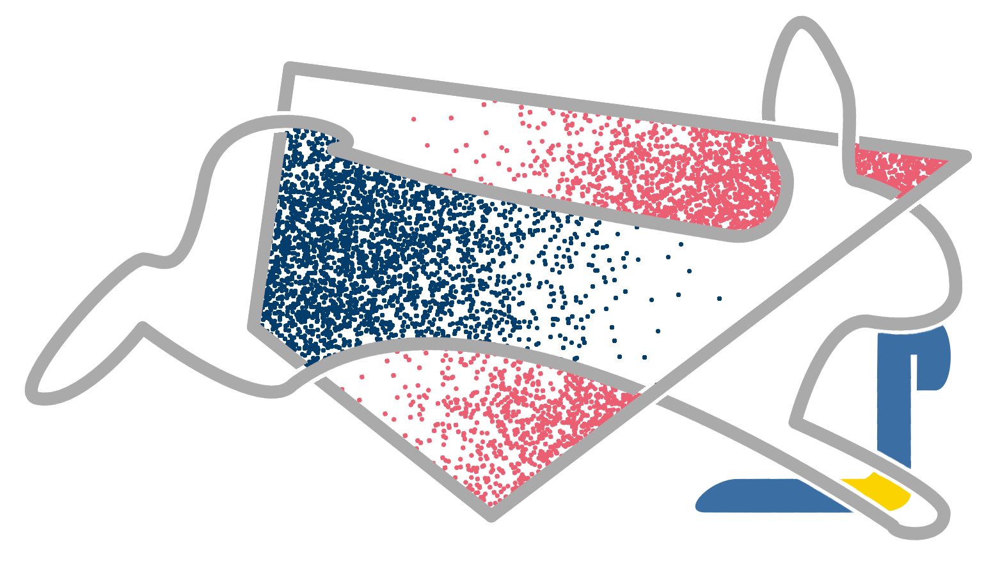

# HOPSY - Python bindings for HOPS

A python interface for HOPS - the **H**ighly **O**ptimized toolbox for **P**olytope **S**ampling.
Built using `pybind11`



**hopsy** is the attempt to offer some of the key functionatlity of **hops** through a Python interface.
hops is a highly template-based C++-library for Markov chain Monte Carlo sampling on convex polytopes
 
P = {x : Ax &#8804; b},

which often arises in metabolic flux analysis.

## Installation

Install using `pip` with
```bash
pip install hopsy
```
or clone this repository and pip install. Note the `--recursive` option which is
needed for hops, eigen and pybind11 submodules:

```bash
git clone --recursive [url-to-this-repo]
cd hopsy
sudo python3 -m pip install -e .
```

Alternatively, the project can be built using basic CMake commands:
```bash
git clone --recursive [url-to-this-repo]
cd hopsy
mkdir build/ && cd build/
make 
```

In this case, the compiled shared library will be located in `build/` and can be used within the directory. 

### Prerequisites for compiling from source

**On Unix (Linux, OS X)**

* A compiler with C++11 support
* CMake >= 3.4 or Pip 10+
* Ninja or Pip 10+
* Docker (optional, for building wheels)


## License


## Examples

A basic usage example is presented below. More examples can be found in `tests/` directory.

```python
import hopsy
import numpy as np

# the polytope is defined as 
#          P := {x : Ax <= b}
# thus we need to define A and b. these constraints form the simple box [0,1]^2.
A = np.array([[1, 0], [0, 1], [-1, 0], [0, -1]])
b = np.array([[1], [1], [0], [0]]);

# next we define our target distribution as an isotropic Gaussian with mean 0 and 
# identity covariance.
mu = np.zeros((2,1))
cov = np.identity(2)

model = hopsy.MultivariateGaussianModel(mu, cov)

# the complete problem is defined by the target distribution and the constrained domain, 
# defined by the above mentioned inequality
problem = hopsy.Problem(A, b, model)

# the run object contains and constructs the markov chains. in the default case, the
# Run object will have a single chain using the Hit-and-Run proposal algorithm and is
# set to produce 10,000 samples.
run = hopsy.Run(problem)

# we finally sample
run.sample()

# from the run, we can now extract the produced data
data = run.get_data()

# the states is a list of lists of numpy.ndarrays, which can be casted to a numpy.ndarray
# which then has the shape (m,n,d), where m is the number of chains, n the number of samples
# and d the dimenion
states  = data.get_states()
```

[`cibuildwheel`]:          https://cibuildwheel.readthedocs.io
[FAQ]: http://pybind11.rtfd.io/en/latest/faq.html#working-with-ancient-visual-studio-2009-builds-on-windows
[vs2015_runtime]: https://www.microsoft.com/en-us/download/details.aspx?id=48145
