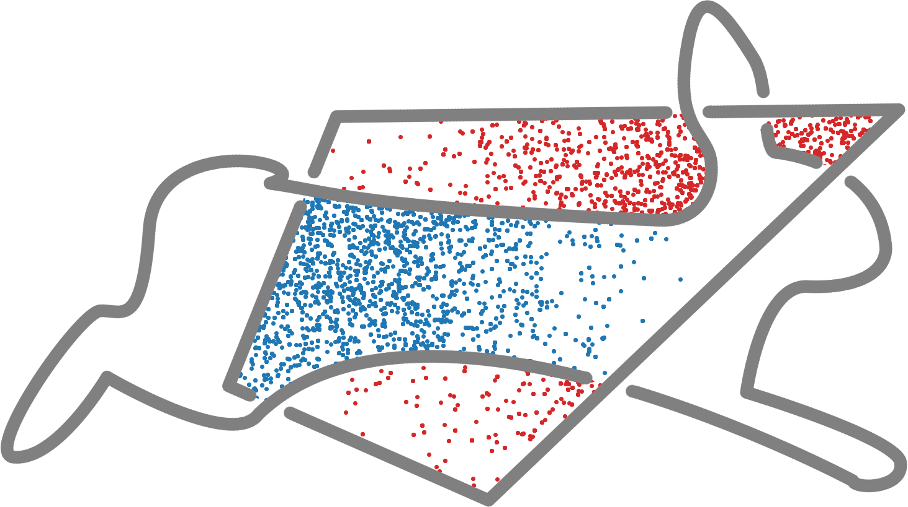

# HOPSY - Python bindings for HOPS

A python interface for HOPS - the **H**ighly **O**ptimized toolbox for **P**olytope **S**ampling.
Built using `pybind11`




## Prerequisites

**On Unix (Linux, OS X)**

* A compiler with C++11 support
* CMake >= 3.4 or Pip 10+
* Ninja or Pip 10+


## Installation

Just clone this repository and pip install. Note the `--recursive` option which is
needed for the pybind11 submodule:

```bash
git clone --recursive [url-to-this-repo]
cd hopsy
sudo python3 -m pip install -e .
```

With the `setup.py` file included in this example, the `pip install` command will
invoke CMake and build the pybind11 module as specified in `CMakeLists.txt`.


## License


## Exampel

```python
import hopsy
import numpy as np

A = np.array([[1, 0], [0, 1], [-1, 0], [0, -1]])
b = np.array([[1], [1], [0], [0]]);

mu = np.zeros((2,1))
cov = np.identity(2)

model = hopsy.MultivariateGaussianModel(mu, cov)
problem = hopsy.Problem(A, b, model)
run = hopsy.Run(problem)

run.sample()

```

[`cibuildwheel`]:          https://cibuildwheel.readthedocs.io
[FAQ]: http://pybind11.rtfd.io/en/latest/faq.html#working-with-ancient-visual-studio-2009-builds-on-windows
[vs2015_runtime]: https://www.microsoft.com/en-us/download/details.aspx?id=48145
