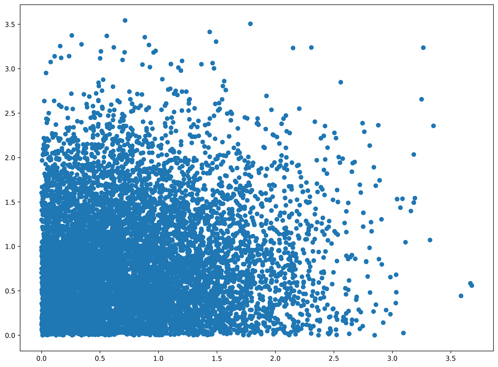

# hopsy - Python bindings for HOPS

 [](https://jugit.fz-juelich.de/fluxomics/hopsy/-/commits/develop)
 [](https://jugit.fz-juelich.de/fluxomics/hopsy/-/jobs/220246/artifacts/file/docs/docov.txt?job=test_release)

A python interface for HOPS - the **H**ighly **O**ptimized toolbox for **P**olytope **S**ampling.
Built using `pybind11`


**hopsy** is a Python package for Markov chain Monte Carlo sampling on convex polytopes

P = {x : Ax &#8804; b},

which often arises in metabolic flux analysis.


## Installation

hopsy can be easily installed from the Python Package Index using ``pip install hopsy``.
It is also possible to install the source dist on pypi in case there is no wheel for your particular OS yet.

Alternatively, you can download the source code from our GitHub repository with

```bash
git clone https://github.com/modsim/hopsy --recursive
```

Note the `--recursive` option which is
needed for hops, eigen and pybind11 submodules.

Next, compile either a binary wheel using pip

```bash
pip wheel --no-deps hopsy/
```

or use the standard CMake routine

```bash
mkdir hopsy/cmake-build-release && cd hopsy/cmake-build-release
cmake ..
make
```

Note however that the binary wheel produced from ``pip`` can be actually installed using ``pip``, using

```bash
pip install hopsy-x.y.z-tag.whl
```

where the version `x.y.z` and tag `tag` will depend on the verison you downloaded and your build environment.
If you use the CMake routine, the compiled shared library will be located in `build/` and can
be used within the directory.

To compile binary wheels for distribution (e.g. via the Python Package Index pypi.org), use the `makewheels.sh` script.


### Prerequisites for compiling from source

**On Unix (Linux, OS X)**

* A compiler with C++11 support
* CMake >= 3.4 or Pip 10+
* Ninja or Pip 10+
* Docker (optional, for building wheels)


## MPI support for parallel tempering

If you want to use the parallel tempering implemented in hops, you need a working MPI installation, because threads would not work due to the python GIL.
The next step is to compile hopsy by source and to check that the script  examples/parallel\_tempering.py works.
Both modes of the distribution should be found, otherwise there is some issue. In this case, please contact us.

In order to use parallel tempering, python interpreter must be called with MPI:

```
mpirun -np 10 parallel_tempering_application.py
```

In this case, 10 parallel chains would be constructed.


## Examples

A basic usage example is presented below. More examples can be found in `tests/` directory or in the docs.

```python
import hopsy
import matplotlib.pyplot as plt

# the polytope is defined as
#          P := {x : Ax <= b}
# thus we need to define A and b. these constraints form the simple box [0,5]^2.
A = [[1, 0], [0, 1], [-1, 0], [0, -1]]
b = [5, 5, 0, 0]

# next we construct a 2-dim standard Gaussian
model = hopsy.Gaussian(dim=2)

# the complete problem is defined by the target distribution and the constrained domain,
# defined by the above mentioned inequality
problem = hopsy.Problem(A, b, model)

# the run object contains and constructs the markov chains. in the default case, the
# Run object will have a single chain using the Hit-and-Run proposal algorithm and is
# set to produce 10,000 samples.
mc = hopsy.MarkovChain(problem, proposal=hopsy.GaussianHitAndRunProposal, starting_point=[.5, .5])
rng = hopsy.RandomNumberGenerator(seed=42)

# call sample on the mc and rng objects
acceptance_rate, states = hopsy.sample(mc, rng, n_samples=10_000, thinning=2)

# the states have 3 dimensions: number of chains, number of samples, number of dimensions.
plt.scatter(states[:,:,0].flatten(), states[:,:,1].flatten())
plt.show()
```




[`cibuildwheel`]:          https://cibuildwheel.readthedocs.io
[FAQ]: http://pybind11.rtfd.io/en/latest/faq.html#working-with-ancient-visual-studio-2009-builds-on-windows
[vs2015_runtime]: https://www.microsoft.com/en-us/download/details.aspx?id=48145

## Development

The development of hopsy primarily takes place on (JuGit)[https://jugit.fz-juelich.de/IBG-1/ModSim/hopsy], where we have access to powerful continuous integration and a Docker registry. The GitHub repository is only a mirror, so please report issues and make pull requests on JuGit.
Please install pre-commit before commiting to our repository, see pre-commit step in .gitlab-ci.yml.


### Building docs & updading docs

```
docs-sources$ make html  # make will tell you which python packages you might be missing
docs-sources$ rm ../docs/* -r
docs-sources$ cp _build/html/* ../docs/ -r
docs-sources$ git add ../ docs && git commit -m "updated docs" && git push  # and so on...
```


## Links
- Source Code & CI: https://jugit.fz-juelich.de/IBG-1/ModSim/hopsy
- PyPI: https://pypi.org/project/hopsy/
- Documentation: https://modsim.github.io/hopsy/
- Github Mirror: https://github.com/modsim/hopsy
- TestPyPI: https://test.pypi.org/project/hopsy/
- HOPS (C++ backend): https://gitlab-public.fz-juelich.de/IBG-1/ModSim/hops


## License

hopsy is licensed under the [MIT license](LICENSE).
