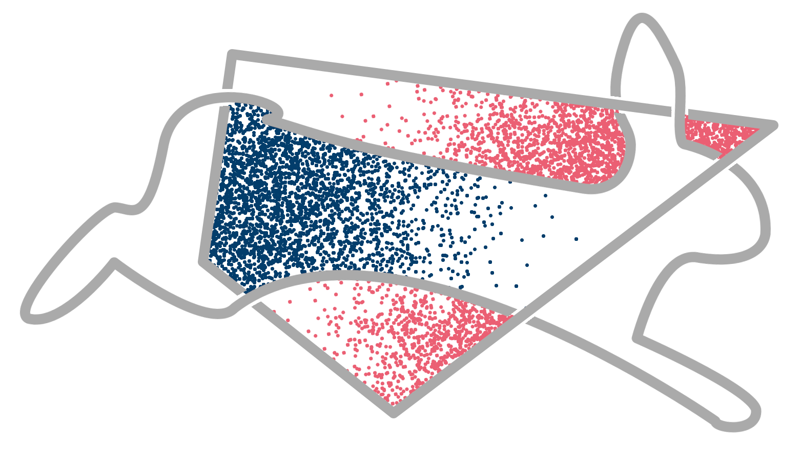

hopsy - Python bindings for hops
================================

A Python interface for hops - the **H**\ ighly **O**\ ptimized toolbox for **P**\ olytope **S**\ ampling.
Built using pybind11.

Contents
--------

.. toctree::
   :maxdepth: 2

   Model <Model.rst>
   Problem <Problem.rst>
   Run <Run.rst>
   Proposal <Proposal.rst>
   Data <Data.rst>

Introduction
------------

**hopsy** is the attempt to offer some of the key functionatlity of **hops** through a Python interface.
hops is a highly template-based C++-library for Markov chain Monte Carlo sampling on convex polytopes

.. math:: \mathcal{P} = \{ x : Ax \leq b \}.

The key functionality of hops is provided by encapsulating the key components of the most common use-cases within four to five "classes":

* The ``hopsy.Model``, which defines the target function to be sampled. hopsy ships with a number of simple target functions
  which can be used out of the box, but also allows to use Python-implemented target functions by wrapping them internally in an appropriate C++-class.

* The ``hopsy.Problem`` collects the key components of a convex polytope sampling problem: the polytope-defining inequality constraints and the target 
  function or, as we call it, the model.

* The ``hopsy.Run`` takes a ``hopsy.Problem`` and then constructs the Markov chains to actually sample the problem. 
  Invoking the ``hopsy.Run.sample()`` method then does the actual work of drawing samples.

* Finally, the ``hopsy.Data`` class collects all data produced when sampling. 
  This consists most prominently of the generated states. 
  Further data stored, are e.g. timestamps, negative log-likelihood values and a few statistics.

These are the "classes", which we deemed most useful and important for any practitioner, who wants to sample a linearily constrained problem at hand. A

.. note:: Note, that we write classes in quotes, as the mentioned ``hopsy.Model``, ``hopsy.Problem`` and ``hopsy.Run`` "classes" are not actually 
   classes.
   In fact, ``hopsy.Model`` rather refers to a non-existent base class of the models implemented in hops and ``hopsy.Problem`` and ``hopsy.Run`` refer to
   the hops template classes ``hops::Problem`` and ``hops::Run``. 
   Since Python does not provide template functionality, we instantiated the ``hops::Problem`` and ``hops::Run`` template classes 
   with the models we provide. 
   This leads to a number of different problem and run classes, which however all behave the same except that they act on different models.
   In order to make this trick more transparent to the user, ``hopsy.Problem`` and ``hopsy.Run`` are two factory methods, 
   which aim at simulating the look and feel of a templated constructor with automatic template deduction.
   Throughout this documentation, we will however use ``hopsy.Model``, ``hopsy.Problem`` and ``hopsy.Run`` also as a placeholder for any of the actually
   available models, problems and runs.

Example code
------------

A short example on how to sample a Gaussian target distribution restricted to :math:`\mathcal{P} = [0,1]^2`.

::

   import hopsy
   import numpy as np
   
   # the polytope is defined as 
   #          P := {x : Ax <= b}
   # thus we need to define A and b. these constraints form the simple box [0,1]^2.
   A = np.array([[1, 0], [0, 1], [-1, 0], [0, -1]])
   b = np.array([[1], [1], [0], [0]]);
   
   # next we define our target distribution as an isotropic Gaussian with mean 0 and 
   # identity covariance.
   mu = np.zeros((2,1))
   cov = np.identity(2)
   
   model = hopsy.MultivariateGaussianModel(mu, cov)
   
   # the complete problem is defined by the target distribution and the constrained domain, 
   # defined by the above mentioned inequality
   problem = hopsy.Problem(A, b, model)
   
   # the run object contains and constructs the markov chains. in the default case, the
   # Run object will have a single chain using the Hit-and-Run proposal algorithm and is
   # set to produce 10,000 samples.
   run = hopsy.Run(problem)
   
   # we finally sample
   run.sample()
   
   # from the run, we can now extract the produced data
   data = run.get_data()
   
   # the states is a list of lists of numpy.ndarrays, which can be casted to a numpy.ndarray
   # which then has the shape (m,n,d), where m is the number of chains, n the number of samples
   # and d the dimenion
   states  = data.get_states()

Python-implemented proposals
----------------------------

At the heart of the sampling process lies the proposal distribution or proposal algorithm, which distincts convex polytope samplers more than 
anything else from more general samplers. 
hops ships with an ever-growing number of such proposal algorithms which can be easily used by calling the appropriate identifier when constructing the
``hopsy.Run``. 
Sometimes, for example when developing novel proposal algorithms, it might be interesting, to quickly prototype them. 
Obviously, C++ is not a favorable choice for rapid prototyping. 
Thus, we provided an interface for using Python-implemented proposals. 
This works by wrapping a Python object, which is passed to ``hopsy.Run()`` in a ``hopsy.PyProposal`` class which internally delegates all calls from
hops to the proposal class to the respective functions of the passed Python-implemented proposal.
For more details and an example on the requirements on the Python-implemented proposals, please refer to ``hopsy.PyProposal``
